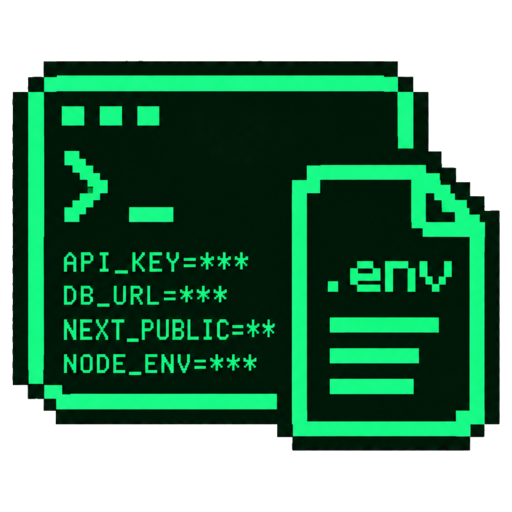

<p align="center">
  
</p>

<h1 align="center">env</h1>

<p align="center"><b>Claude sets up your secrets. It never sees them.</b></p>

<p align="center">
  A Claude Code mod for <code>.env</code> files.<br>
  Claude knows which keys exist and asks you for values. You paste them into a pane it can't read.
</p>

<p align="center">
  
  
  <a href="LICENSE"></a>
</p>

---

You're wiring up a deploy with Claude, and it needs your Cloudflare account ID. So it tells you to "add it to your .env", and you go find the dashboard, find the field, open the file, paste, save. Or you're in a hurry and paste it straight into the chat, where it now lives in a transcript forever. Either way, Claude can `cat .env` whenever it likes.

With env, Claude asks with a card instead: what it needs, why, the steps to find it, and a link to the exact page. You paste the value and press Enter. Claude hears back `CLOUDFLARE_ACCOUNT_ID is now set in .env` and carries on.

The value went into the file. It never went into the conversation.

```
╭──────────────────────────────────────────────────────╮
│ Claude needs a value                                 │
│                                                      │
│ CLOUDFLARE_ACCOUNT_ID → .env                         │
│ Wrangler needs it to deploy the worker               │
│                                                      │
│ 1. Open the Cloudflare dashboard                     │
│ 2. Click ⋯ next to your account name                 │
│ 3. Click Copy account ID                             │
│                                                      │
│ https://dash.cloudflare.com   copy link              │
│ Looks like: 32-character hex                         │
│                                                      │
│ Paste ▸ ________________________________   save      │
│ ✓ looks right                                        │
│ skip for now                                         │
╰──────────────────────────────────────────────────────╯
```

## Get started

```
/plugin marketplace add davekiss/env
/plugin install env@davekiss
```

Then ask Claude for something that needs a key, or type `/env` to open the pane yourself.

## What it's good at

### It asks the way a teammate would

When Claude needs a value it calls `mcp__env__request`, and you get a card with the steps to find it, named by the labels on screen, plus the link to the page it lives on. If Claude knows what a valid value looks like, the card checks your paste as you type: `✓ looks right`, or a red warning when you've copied the account name instead of the ID. Enter still saves, since you know better than a regex.

Skip it or close the pane, and Claude is told that too, so it never sits waiting on you.

> *"Set up the Stripe keys."* · *"I need a Cloudflare token for Workers AI."* · *"Fill in whatever .env.example has that I'm missing."*

### Claude never sees a value

Two layers keep values out of the conversation:

1. **The fence.** Claude's Read, Edit, Write and Grep can't open `.env*` files. Bash commands that read them (`cat .env`, `source .env`, `printenv`) are refused, and the refusal points Claude to env's own tools. Templates like `.env.example` stay readable.
2. **The scrubber.** Any value in your env files that's 8 characters or longer is replaced with `[env:KEY]` in every tool result, message and prompt before it's stored or sent. That catches the indirect leaks, like a script that prints `process.env`. The fence is best-effort; the scrubber is the guarantee.

Programs that load `.env` themselves, like `npm run dev` or your tests, run normally.

### It still does the busywork

Claude can manage your env files without reading them:

| Tool | What it does |
| --- | --- |
| `mcp__env__list` | Lists keys and what each value looks like (kind, length, a known prefix like `sk_live_`), never the value |
| `mcp__env__request` | Shows you the card above |
| `mcp__env__generate` | Writes a random secret (auth secrets, signing keys) without returning it |
| `mcp__env__copy` | Copies a value to another file, or to a new key name, without reading it |
| `mcp__env__remove` | Comments a key out, so you can bring it back |
| `mcp__env__push` | Runs a hosting CLI (`vercel`, `gh`, `wrangler`, `fly`…) with `{{KEY}}` filled in from your env file, after you approve the command |
| `mcp__env__pull` | Runs a hosting or secrets CLI (`vercel env pull`, `doppler`, `op read`…) and writes what it returns into your env file, reporting only which keys changed |

> *"Rename CLOUDFLARE_API_TOKEN to CLOUDFLARE_AUTH_TOKEN."* · *"Copy the database URL into .env.test."* · *"Generate a NEXTAUTH_SECRET."*

### It talks to your host

Claude can send a value to Vercel, GitHub Actions, Cloudflare and the rest through the CLIs you're already logged into. It writes the command with a placeholder, you approve it, and env fills in the value and pipes it to the CLI's stdin:

```
Run `vercel env add STRIPE_SECRET_KEY production < "{{STRIPE_SECRET_KEY}}"`
with STRIPE_SECRET_KEY filled in from .env.local?
```

Only known hosting CLIs run (`vercel`, `gh`, `wrangler`, `fly`, `netlify`, `railway`, `heroku`, `supabase`, `firebase`, `render`, `doppler`, `op`, `aws`, `gcloud`, `az`), and any value that comes back in their output is redacted before Claude reads it.

It works the other way too. `mcp__env__pull` runs `vercel env pull`, `doppler secrets download`, `heroku config` or `op read` and merges the result into your env file, keeping your comments and order. A key you already set to something else is left alone unless you agree to replace it.

> *"Push the Stripe keys to Vercel production."* · *"Set the Cloudflare token as a GitHub Actions secret."* · *"Pull the dev env from Vercel."* · *"Get the Stripe key from 1Password."*

### It edits the file the way you wrote it

`/env` opens a pane with a tab for each `.env*` file in the project root. Values are masked (`sk_live_••••4f2a`), and each key has buttons to copy, edit, show or delete it. **+ add key** adds a new one, and keys that `.env.example` has but your file doesn't are listed so you can fill them in with one click. A warning shows if the file isn't in `.gitignore`.

Comments, ordering and quoting stay as you wrote them. Only the line you change is rewritten.

### It fits a narrow terminal

A pane that Claude opens on its own needs 144 columns. Below that, the card shows in the band above the prompt instead, and Claude tells you to paste it there. Type `/env` or press **open /env pane** whenever you want the full pane.

## Limits

- The paste field isn't masked, so a value is visible on your screen until you press Enter.
- Values shorter than 8 characters, booleans and numbers aren't scrubbed.
- Only the project root is scanned. Monorepo subfolders aren't covered yet.
- Don't paste a secret into the chat box. A value only gets scrubbed once it's saved in an env file.
- The pane draws in the terminal and the desktop app's Code tab. In the VS Code extension and `claude -p`, the fence, scrubber and tools still work, but there's no pane.

## Development

```sh
claude plugin validate .
claude plugin test .
claude --plugin-dir "$PWD"   # load the mod from this checkout
```

To release, bump the version in `.claude-plugin/plugin.json` and the badge above, then push.

## License

MIT
